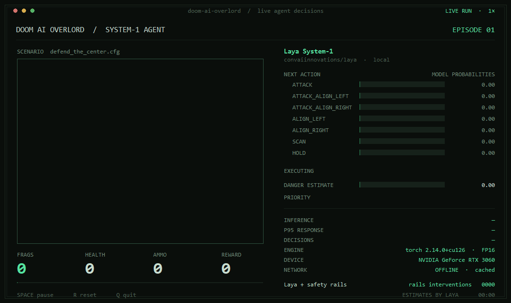

# Doom AI Overlord

**A 421M-parameter decision model plays Doom — one forward pass per decision, ~55 ms,
fully local, no LLM in the loop.**

Every choice in the demo below is a single forward pass of
[convaiinnovations/laya](https://huggingface.co/convaiinnovations/laya) (the open Apache-2.0
alternative to TypeSafe's proprietary "Jev") over a compact game state — no chain-of-thought,
no cloud, no Doom-specific training. [ViZDoom](https://vizdoom.farama.org/) executes its
decisions in real time.

A curiosity, but a deliberate one: it's a test bench for how far a small, fast, calibrated
decision model can get on a reactive control problem when you give it clean geometry, honest
goals, and hard safety rails.

## Demo

The console app running live (frameless capture, recorded once the model is loaded —
`uv run doom-app --capture docs/assets/app-demo.gif --capture-seconds 32`):



Watch it live with the desktop app — the game view plus a stats sidebar (hardware, agent
state, vitals, response-time performance, key bindings, events):

```bash
uv run doom-app
```

Record your own demo video:

```bash
uv run doom-app --record docs/assets/demo.mp4 --poster docs/assets/demo_poster.jpg
```

## Results (verified, RTX 3060)

| Scenario | Behavior | Outcome |
|---|---|---|
| `defend_the_center` | turn + shoot only | 11 kills/episode; survives longer as ammo-conservation goals kick in |
| `basic` | strafe to align, then shoot | solved in 2 decisions (+95 reward) |
| `deadly_corridor` | advance, fight, retreat when hit at low HP | positive shaped reward with goal-driven retreats |

## Setup

Requires [uv](https://docs.astral.sh/uv/) and an NVIDIA GPU (torch is pinned to the CUDA 12.6
build in `pyproject.toml`; CPU works too, just slower).

```bash
uv sync
```

The Laya model (~850 MB) downloads automatically from Hugging Face on first run.

## Run

```bash
# Watch it play (game window)
uv run doom-agent

# A different scenario
uv run doom-agent --scenario deadly_corridor

# Headless, short smoke test
uv run doom-agent --headless --episodes 1 --max-steps 60

# Tune the goals (engine reward shaping)
uv run doom-agent --survival 2.0 --pressure 0.5
```

Options: `--scenario` (default `defend_the_center.cfg`), `--episodes`, `--max-steps`,
`--headless`, `--model`, `--device`, `--survival`, `--pressure`.

## How it works

Per decision step: screen labels → deterministic geometry (nearest monster, alignment, range,
corpse filtering) → compact state dict → **one Laya forward pass** answers three questions
(tactical choice, goal priority, danger probability) → safety rails enforce alignment
direction, ammo and blind-scan rules → action vector with a tic budget → `make_action`.
Kill confirmation comes from the reward returned by `make_action` (kill rewards are
programmed in each scenario's WAD script). The agent generalizes across scenarios by
detecting the available buttons (turn / strafe / move / attack) and adapting its action
space, questions and rails accordingly.

Full details in [`docs/`](docs/):

- [`docs/laya-model.md`](docs/laya-model.md) — what Laya is, its exact API, and the mechanics
  that matter (no templating, token budget, confidence ≠ accuracy).
- [`docs/vizdoom-defend-the-center.md`](docs/vizdoom-defend-the-center.md) — scenario rules,
  reward structure, API facts.
- [`docs/agent-design.md`](docs/agent-design.md) — the perception → decision → actuation
  pipeline, goal/priority system, and safety rails.

## Repository layout

```
src/doom_ai_overlord/
  perception.py   labels -> state dict + geometry (what the agent sees)
  decisions.py    capabilities, action maps, Laya questions, goal arbiter, safety rails
  agent.py        game setup + episode_steps(), the pipeline everything drives
  cli.py          doom-agent: terminal runner
  app.py          doom-app: console UI + GIF/video recorders
  hud.py          HUD overlay + hardware info for recordings
docs/             research notes and design decisions
docs/assets/      demo GIF and previews
pyproject.toml    uv project; torch pinned to the CUDA 12.6 index
```

## Contributing

Contributions are welcome — scenarios, behaviors, stats, docs. See
[CONTRIBUTING.md](CONTRIBUTING.md) for setup, the module map, and how to verify behavior
changes, and the [issue tracker](https://github.com/JohGirard/doom-ai-overlord/issues) for
`good first issue` entries. Be excellent to each other:
[CODE_OF_CONDUCT.md](CODE_OF_CONDUCT.md).

## Roadmap

- [ ] Session logging — record every decision (state, model answers, reward) as training data
- [ ] Fine-tune Laya on session trajectories (RLCD-style, using the package's own training helpers)
push- [ ] Custom scenario (custom WAD) tuned to expose the agent's weaknesses

## License

MIT (see [LICENSE](LICENSE)). Laya is Apache-2.0, ViZDoom is GPL-2.0; scenario WADs ship
with ViZDoom.
